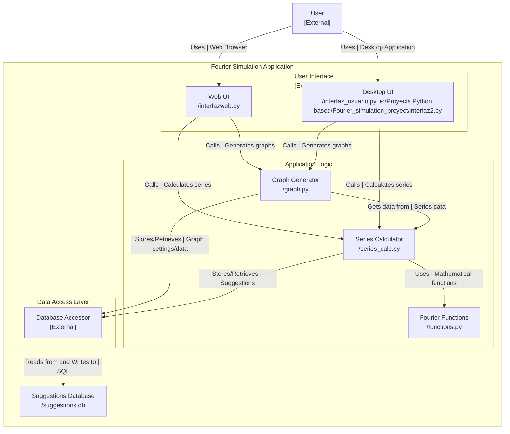
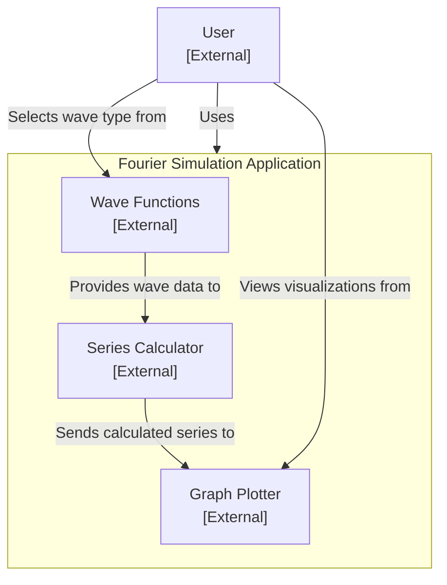

# Unnamed CodeViz Diagram

```mermaid
graph TD

    user["User<br>[External]"]
    subgraph fourier_app_boundary["Fourier Simulation Application<br>[External]"]
        suggestions_db_container["Suggestions Database<br>/suggestions.db"]
        subgraph ui_boundary["User Interface<br>[External]"]
            desktop_ui["Desktop UI<br>/interfaz_usuario.py, e:/Proyects Python based/Fourier_simulation_proyect/interfaz2.py"]
            web_ui["Web UI<br>/interfazweb.py"]
        end
        subgraph logic_boundary["Application Logic<br>[External]"]
            fourier_functions["Fourier Functions<br>/functions.py"]
            series_calculator["Series Calculator<br>/series_calc.py"]
            graph_generator["Graph Generator<br>/graph.py"]
            %% Edges at this level (grouped by source)
            series_calculator["Series Calculator<br>/series_calc.py"] -->|"Uses | Mathematical functions"| fourier_functions["Fourier Functions<br>/functions.py"]
            graph_generator["Graph Generator<br>/graph.py"] -->|"Gets data from | Series data"| series_calculator["Series Calculator<br>/series_calc.py"]
        end
        subgraph data_access_boundary["Data Access Layer<br>[External]"]
            database_accessor["Database Accessor<br>[External]"]
        end
        %% Edges at this level (grouped by source)
        desktop_ui["Desktop UI<br>/interfaz_usuario.py, e:/Proyects Python based/Fourier_simulation_proyect/interfaz2.py"] -->|"Calls | Calculates series"| series_calculator["Series Calculator<br>/series_calc.py"]
        desktop_ui["Desktop UI<br>/interfaz_usuario.py, e:/Proyects Python based/Fourier_simulation_proyect/interfaz2.py"] -->|"Calls | Generates graphs"| graph_generator["Graph Generator<br>/graph.py"]
        web_ui["Web UI<br>/interfazweb.py"] -->|"Calls | Calculates series"| series_calculator["Series Calculator<br>/series_calc.py"]
        web_ui["Web UI<br>/interfazweb.py"] -->|"Calls | Generates graphs"| graph_generator["Graph Generator<br>/graph.py"]
        series_calculator["Series Calculator<br>/series_calc.py"] -->|"Stores/Retrieves | Suggestions"| database_accessor["Database Accessor<br>[External]"]
        graph_generator["Graph Generator<br>/graph.py"] -->|"Stores/Retrieves | Graph settings/data"| database_accessor["Database Accessor<br>[External]"]
        database_accessor["Database Accessor<br>[External]"] -->|"Reads from and Writes to | SQL"| suggestions_db_container["Suggestions Database<br>/suggestions.db"]
    end
    %% Edges at this level (grouped by source)
    user["User<br>[External]"] -->|"Uses | Desktop Application"| desktop_ui["Desktop UI<br>/interfaz_usuario.py, e:/Proyects Python based/Fourier_simulation_proyect/interfaz2.py"]
    user["User<br>[External]"] -->|"Uses | Web Browser"| web_ui["Web UI<br>/interfazweb.py"]

```
# Unnamed CodeViz Diagram

```mermaid
graph TD

    base.cv::user["User<br>[External]"]
    subgraph base.cv::fourier_app["Fourier Simulation Application<br>[External]"]
        base.cv::functions_comp["Wave Functions<br>[External]"]
        base.cv::series_calc_comp["Series Calculator<br>[External]"]
        base.cv::graph_comp["Graph Plotter<br>[External]"]
        %% Edges at this level (grouped by source)
        base.cv::functions_comp["Wave Functions<br>[External]"] -->|"Provides wave data to"| base.cv::series_calc_comp["Series Calculator<br>[External]"]
        base.cv::series_calc_comp["Series Calculator<br>[External]"] -->|"Sends calculated series to"| base.cv::graph_comp["Graph Plotter<br>[External]"]
    end
    %% Edges at this level (grouped by source)
    base.cv::user["User<br>[External]"] -->|"Selects wave type from"| base.cv::functions_comp["Wave Functions<br>[External]"]
    base.cv::user["User<br>[External]"] -->|"Views visualizations from"| base.cv::graph_comp["Graph Plotter<br>[External]"]
    base.cv::user["User<br>[External]"] -->|"Uses"| base.cv::fourier_app["Fourier Simulation Application<br>[External]"]

```
---
*Generated by [CodeViz.ai](https://codeviz.ai) on 11/10/2025, 10:46:32 PM*
